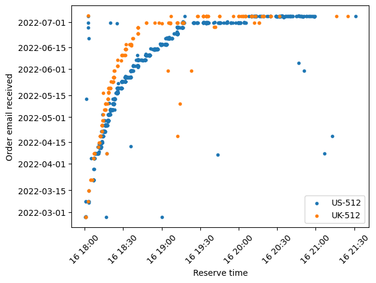

## Readme

Script to show the current rate of shipments by Valve for the steam deck and outputting to a graph.





* Source for data: https://docs.google.com/spreadsheets/d/1QqlSUpqhyBCBYeu_gW4w5vIxfcd7qablSviALDFJ0Dg
* Steam Deck Calculator: https://steam-deck-calculator.web.app/
* Form for the spreadsheet: https://forms.gle/vfU1UwU3NoYXNmiG8


## Install

```
py -m venv env --upgrade-deps
.\env\Scripts\activate
pip install -r requirements
```

## Usage

```
py main.py --update uk-512 us-512
```


### Arguments

```
usage: main.py [-h] [--update] [--dpi DPI] [--stats] [--outfile OUTFILE] [models ...]

positional arguments:
  models                The models and region to display. Format is region-model#, e.g. uk-512. 'all' can be used to
                        show all models/regions

options:
  -h, --help            show this help message and exit
  --update              Download a fresh copy of the data from the Google Spreadsheet
  --dpi DPI             Resolution in dots per inch (default: 100)
  --stats               Print to terminal basic stats about orders
  --outfile OUTFILE, -o OUTFILE
                        Location and name (relative) to save the image (default: graph.png)
```